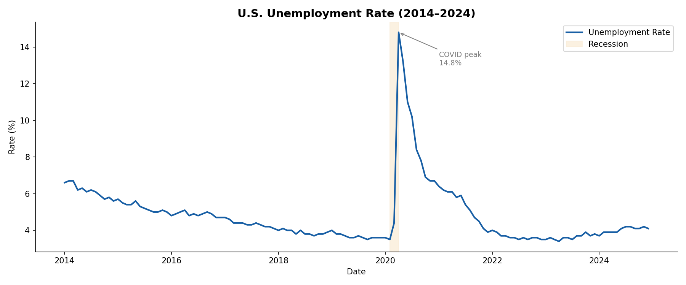
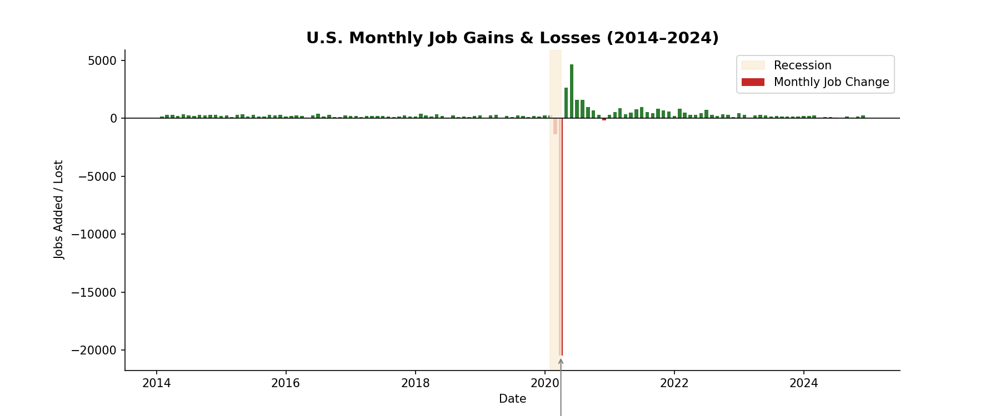
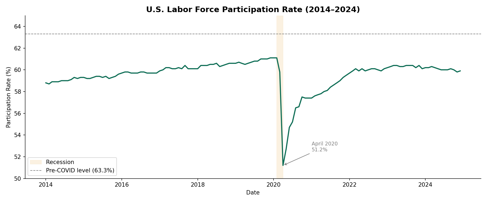
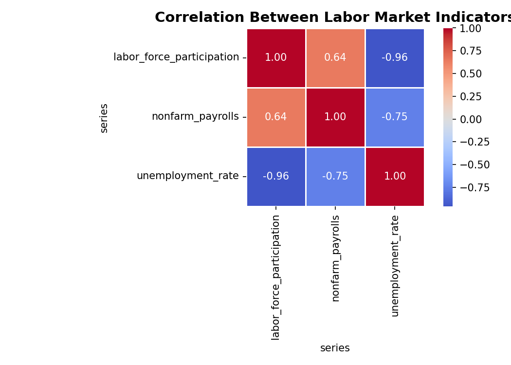

# U.S. Job Market Dashboard


An end-to-end data analysis project exploring 10 years of U.S. labor market trends
using official Bureau of Labor Statistics (BLS) data.

## Live Charts





## Key Insights
- **COVID impact was historic** — unemployment spiked to 14.8% in April 2020,
  the highest rate since the Great Depression, with 22 million jobs lost in 8 weeks
- **Recovery was faster than expected** — unemployment fell back to 3.7% by 2024,
  driven by $5 trillion in government stimulus and strong consumer demand
- **Labor force participation never fully recovered** — the participation rate remains
  below its pre-COVID level of 63.3%, suggesting ~3 million Americans have not
  returned to the workforce
- **Unemployment and participation are strongly linked** — a -0.9 correlation confirms
  that when jobs disappear, workers exit the labor force entirely rather than
  continuing to search

## Tech Stack
- **Python** — data collection, cleaning, analysis
- **Pandas** — data wrangling and transformation
- **Matplotlib & Seaborn** — data visualization
- **BLS Public API** — official U.S. government labor data
- **Jupyter Notebook** — interactive analysis environment
- **SQLite** — local data storage and SQL querying

## Project Structure
us-job-market-dashboard/
├── data/
│   ├── raw/          # BLS API responses
│   └── processed/    # cleaned CSVs and chart images
├── notebooks/
│   └── 01_data_collection.ipynb
├── src/
│   └── bls_fetcher.py
├── requirements.txt
└── README.md

## How to Run Locally
1. Clone the repo
```bash
   git clone https://github.com/Kamrul732/us-job-market-dashboard.git
   cd us-job-market-dashboard
```
2. Create a virtual environment
```bash
   python3 -m venv venv
   source venv/bin/activate
   pip install -r requirements.txt
```
3. Add your BLS API key to a `.env` file
BLS_API_KEY=16c70740f37942d4b1eb87e52b955a66

4. Run the data fetcher
```bash
   python src/bls_fetcher.py
```
5. Open the notebook
```bash
   jupyter notebook notebooks/01_data_collection.ipynb
```

## Data Source
Bureau of Labor Statistics (BLS) Public API — [bls.gov/developers](https://bls.gov/developers)
Series used: LNS14000000, CES0000000001, LNS12300000